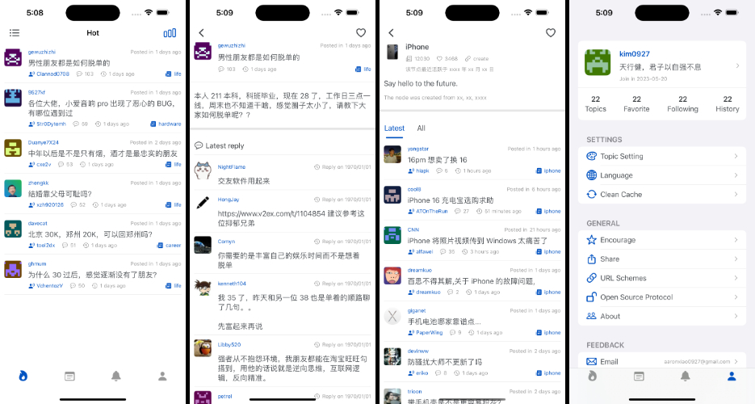
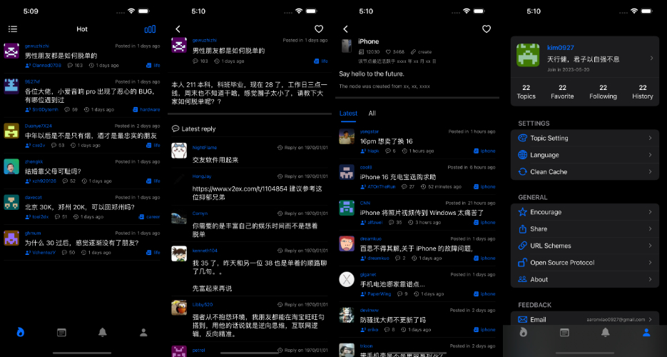

# V2EX App

A modern **V2EX** client built with **SwiftUI**, leveraging **Combine** and the **MVVM** architectural pattern for a seamless and reactive user experience.

## Features

- **SwiftUI** for a fully native and declarative UI design.
- **Combine** to handle reactive programming and asynchronous data streams.
- **MVVM** architecture for a clean separation of concerns and testable code.
- Custom caching mechanism using local storage.
- Multi-language support, including English and Simplified Chinese.
- System-wide **dark mode** and **light mode** integration.

## Language

- [中文文档](./README_CN.md)


## Screenshots






## Installation

1. Clone the repository:
   ```bash
   git clone https://github.com/Aaron0927/V2EX.git
   ```
2. Open the `.xcodeproj` file in Xcode.
3. Select your desired simulator or device.
4. Build and run the project.

## Technologies Used

- **SwiftUI**: A modern declarative framework for building user interfaces across all Apple platforms.
- **Combine**: A framework for handling asynchronous events by combining declarative Swift APIs.
- **MVVM**: Clean and scalable architecture, enabling the clear separation of UI logic from business logic.
- **Local Storage**: Custom file management system for caching images and user data efficiently.
- **AppStorage & UserDefaults**: Persist lightweight app settings and preferences.
- **Networking**: Fetch data from the V2EX API in a reactive and efficient manner.

## Project Structure

The app is organized into the following directories:

- `Models`: Contains the data models used throughout the app.
- `ViewModels`: Contains the business logic and state management using Combine.
- `Views`: Contains SwiftUI views that make up the app's user interface.
- `Managers`: Utility classes like file management, networking, and caching.

## How It Works

1. **Data Binding**:

   - App state and user data are stored in ObservableObjects and synchronized via `@Published` properties.
   - SwiftUI views automatically react to state changes, eliminating the need for manual UI updates.

2. **Networking**:

   - Network requests are handled using URLSession with Combine's `Publisher` pipelines for asynchronous tasks.

3. **Caching**:

   - Images and other data are cached locally using a custom caching manager.

4. **Theme Support**:

   - Fully supports system theme settings (dark/light mode) and allows users to toggle manually within the app.

## Contribution

We welcome contributions to improve the app. To contribute:

1. Fork the repository.
2. Create a feature branch:
   ```bash
   git checkout -b feature-name
   ```
3. Commit your changes and push to your fork:
   ```bash
   git push origin feature-name
   ```
4. Open a pull request to the `main` branch.

## License

This project is licensed under the MIT License. See the [LICENSE](LICENSE) file for details.

## Acknowledgments

- Thanks to the **V2EX** community for providing an amazing platform.
- Apple for the incredible SwiftUI and Combine frameworks.

---

Feel free to report issues or suggest features by opening an issue in the repository: [V2EX GitHub](https://github.com/Aaron0927/V2EX/).

