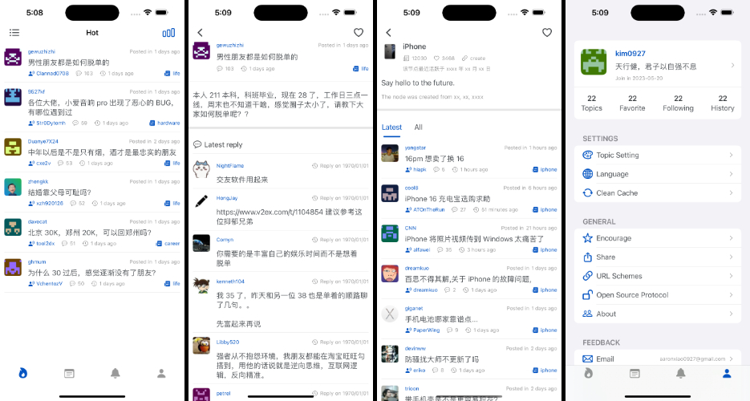

# V2EX 应用

一个使用 **SwiftUI** 构建的现代化 **V2EX** 客户端，结合 **Combine** 和 **MVVM** 架构，为用户带来流畅的响应式体验。

## 功能特点
- 使用 **SwiftUI** 构建完全原生的声明式 UI。
- 基于 **Combine** 处理响应式编程和异步数据流。
- **MVVM** 架构，清晰的分层设计和可测试代码。
- 自定义缓存机制，支持本地存储。
- 多语言支持，包括英语和简体中文。
- 深色模式和浅色模式的无缝集成。

## 截图




## 安装方法

1. 克隆项目代码：
   ```bash
   git clone https://github.com/Aaron0927/V2EX.git
   ```
2. 在 Xcode 中打开 `.xcodeproj` 文件。
3. 选择目标模拟器或设备。
4. 构建并运行项目。

## 使用技术

- **SwiftUI**: 用于构建跨 Apple 平台的现代声明式用户界面。
- **Combine**: 处理异步事件的响应式框架。
- **MVVM**: 干净且可扩展的架构，分离 UI 逻辑与业务逻辑。
- **本地存储**: 使用自定义文件管理系统高效缓存图像和用户数据。
- **AppStorage 和 UserDefaults**: 持久化轻量级的应用设置和偏好。
- **网络请求**: 使用 V2EX API 高效地获取数据。

## 项目结构

应用按照以下目录组织：

- `Models`：包含应用中的数据模型。
- `ViewModels`：使用 Combine 管理业务逻辑和状态。
- `Views`：包含构成应用用户界面的 SwiftUI 视图。
- `Managers`：包含实用类，如文件管理、网络请求和缓存。

## 工作原理

1. **数据绑定**：
   - 应用状态和用户数据存储在 ObservableObject 中，通过 `@Published` 属性进行同步。
   - SwiftUI 视图自动响应状态变化，无需手动更新 UI。

2. **网络请求**：
   - 使用 URLSession 和 Combine 的 `Publisher` 管道处理异步任务。

3. **缓存**：
   - 使用自定义缓存管理器将图像和其他数据保存在本地。

4. **主题支持**：
   - 完全支持系统主题设置（深色/浅色模式），并允许用户在应用中手动切换。

## 贡献

欢迎为此项目做出贡献，贡献方法如下：
1. Fork 此仓库。
2. 创建一个新分支：
   ```bash
   git checkout -b feature-name
   ```
3. 提交更改并推送到您的 Fork：
   ```bash
   git push origin feature-name
   ```
4. 向 `main` 分支发起 Pull Request。

## 许可证

此项目使用 MIT 许可证授权。详情请参阅 [LICENSE](LICENSE) 文件。

## 鸣谢

- 感谢 **V2EX** 社区提供了一个优秀的平台。
- 感谢 Apple 提供出色的 SwiftUI 和 Combine 框架。

---
欢迎在仓库中通过 [V2EX GitHub](https://github.com/Aaron0927/V2EX/) 提交问题或提出功能建议。

